# 小程序使用 vant 和 taro-ui 组件
####1.vant组件
> 1. 用微信开发正工具创建一个空的微信小程序
> 2. 输入 npm init 初始化一个package.json文件，一路回车默认即可，这样项目就会产生一个package.json文件
> 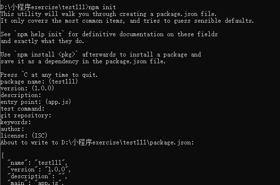
> 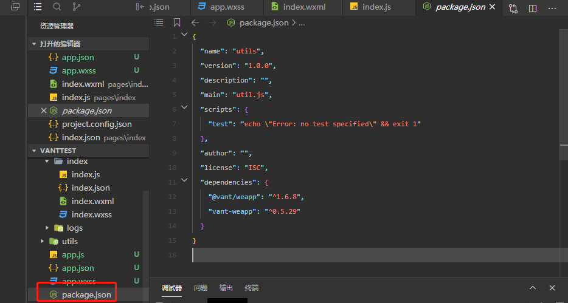
> 3. 安装vant组件库: npm i vant-weapp -S --production
> 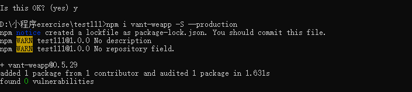
> 4.将 app.json 中的 "style": "v2" 去除，小程序的新版基础组件强行加上了许多样式，难以覆盖，不关闭将造成部分组件样式混乱。
> 5. 构建npm: 在微信开发者工具的菜单栏中找到 工具-构建npm，等待构建完成，会出现miniprogram_npm文件夹
> 6. 在微信开发者工具的详情里面将“使用npm模块"勾选上，如下：
> 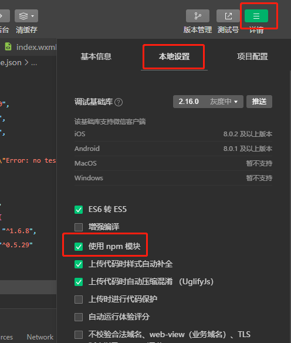

**使用vant 组件 （以button为例）**
-  app.json 中引入
```
"usingComponents": {
  "van-button": "@vant/weapp/button/index"
}
```
- 会出现报错 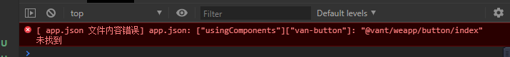
- 解决方法：
- 1. 需要先在miniprogram文件里初始化package.json，miniprogram文件夹上鼠标右击--选择在终端打开，输入 npm init -y
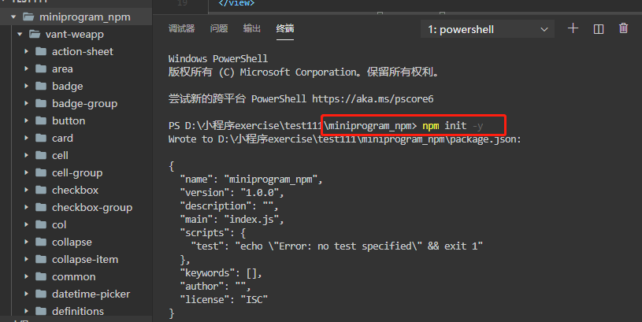
- 2. 在miniprogram文件里下载npm资源包:  npm i @vant/weapp -S --production
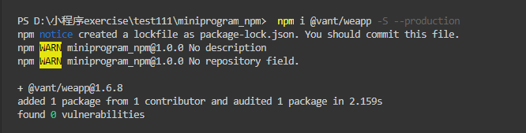
- 3. 在 工具-构建npm，重新构建npm

**说明**
这里需要注意一下npm i vant-weapp -S --production或者npm i @vant/weapp -S --production引入的区别
```
npm i vant-weapp安装的时候，在app.json中引入组件，需要使用这样的路径
{
	"usingComponents": {
		"van-button": "../../miniprogram_npm/vant-weapp/button/index"
	}
}
```
```
npm i @vant/weapp安装的时候，到在app.json中引入组件，需要使用这样的路径（推荐，因为这个可以直接抄文档，不需要改变引入路径的~）
{
	"usingComponents": {
		"van-button": "@vant/weapp/button/index"
	}
}
```
####2.Taro UI 组件

>  1. 安装 Taro 脚手架工具：  npm install -g @tarojs/cli
>  2. 初始化项目，使用命令创建模板项目： taro init myApp (myApp是自己定义名称)
>  3.安装 Taro UI： cd myApp  --->  npm install taro-ui
>  4.由于引用 `node_modules` 的模块，默认不会编译，所以需要额外给 H5 配置 `esnextModules`，在 taro 项目的 `config/index.js` 中新增如下配置项：
> 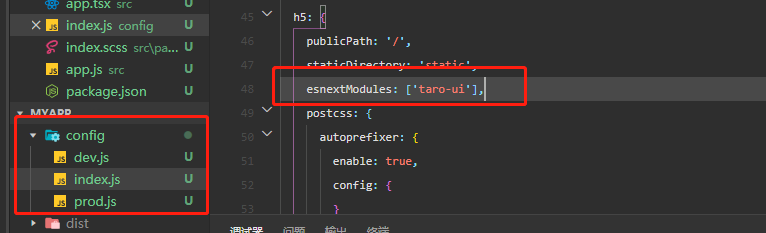
> 5.新建app.tsx文件，并引入taro-ui, 在 app.scss 样式文件中 import 组件样式并按照文档说明使用
> 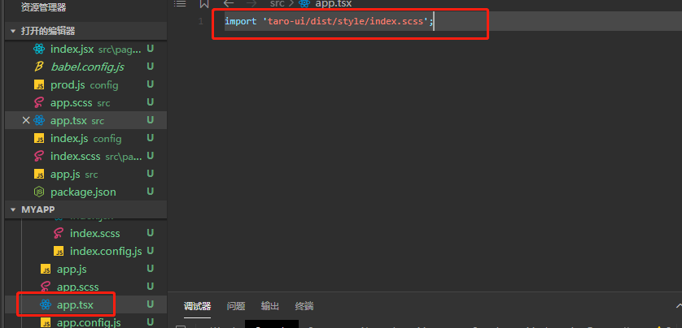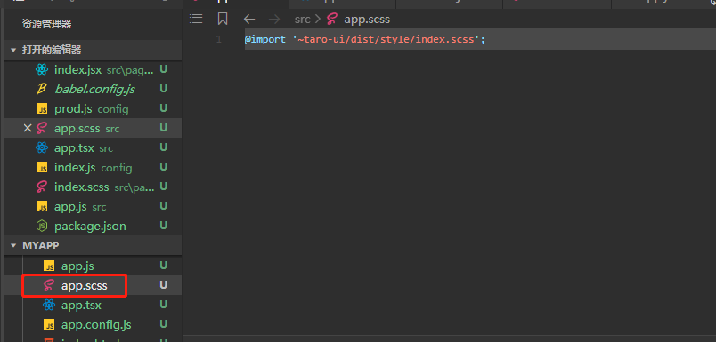
```
index.jsx 使用
<view>  
	<AtButton type='primary'>按钮文案</AtButton>
</view>
<View className='at-icon at-icon-settings'></View>
	<AtBadge value={10} maxValue={99}>
	<AtButton size='small'>按钮</AtButton>
</AtBadge>
```


**taro 引入taro-ui,使用组件就会报错**
- 报错 ./node_modules/taro-ui/dist/weapp/index.ts Module not found: Can’t resolve ‘./style/index.scss’ in ‘D:\projects\dev\self\myApp\node_modules\taro-ui\dist\weapp’
- 可能是由于taro 使用的3.0，但是taro-ui还是2.3.4，所以路径不对
- 在package.json中devDependencies 中 写上 "taro-ui": "^3.0.0-alpha",
- 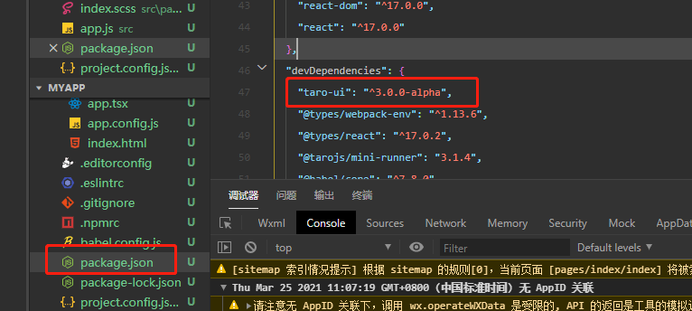
- 把之前node_modules删了，然后把package.json文件中的原taro UI相关删掉，改成如下，重新npm install一下
- 使用  npm run dev:weapp 编译，出现编译成功即可
- 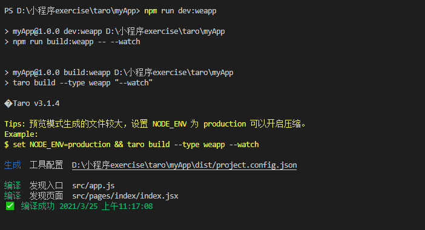


